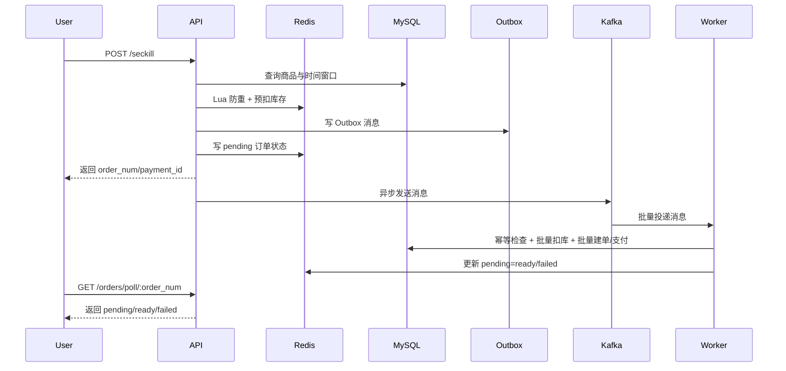

# 架构概览

## 目标
- 在秒杀入口承受高并发请求
- 保障库存、订单、支付状态的一致性
- 将热点链路与重事务链路解耦
- 为风控、观测、补偿、VIP/优惠券提供扩展点

## 系统分层
```text
handler -> service -> repository
              |           |
              v           v
           Redis/Kafka   MySQL
```

### 分层职责
- `internal/handler`：参数绑定、鉴权后的请求校验、响应映射
- `internal/service`：业务编排、事务、一致性、缓存、异步状态管理
- `internal/repository`：数据库访问与查询封装
- `internal/middlerware`：JWT、日志、指标、限流、黑灰名单
- `internal/infra`：Redis/Kafka 基础设施初始化与封装
- `internal/pkg`：错误码、日志、JWT、Snowflake、VIP 等通用能力

## 进程拓扑
### API 进程
- 入口：`cmd/api/main.go`
- 作用：对外暴露 HTTP API，初始化 DB/Redis/Kafka Producer、自动迁移、修正过期优惠券

### Worker 进程
- 入口：`cmd/worker/main.go`
- 作用：批量消费 Kafka 秒杀消息，执行 Outbox 补偿与 VIP 月度发券定时任务

## 核心时序


## 秒杀链路设计
### 入口保护
- Redis Lua 保证“判重 + 扣库存 + 用户标记”原子执行
- 限流分两层：
  - 本地内存令牌桶，先挡住突发流量
  - Redis 分布式桶，保证多实例下一致频控

### 异步建单
- 入口只负责“抢资格”
- 订单落库交给 Kafka Worker
- 这样把高并发热点与数据库事务解耦，减轻锁竞争与慢查询风险

### 前后端桥梁
- Redis `PendingOrderCache` 承接秒杀结果状态
- 前端无需等待同步建单完成，而是以低成本轮询获取 ready/failed

## 一致性策略
### 库存一致性
- Redis：入口实时库存源
- MySQL：最终库存事实源
- Worker 事务失败时，回滚 Redis 库存与用户标记

### 消息一致性
- 使用 Outbox Pattern，而不是仅依赖“Kafka 发送成功”
- 发送失败时由 Outbox 定时补偿任务兜底
- 超过重试上限的消息可进入死信主题

### 幂等性
- Redis `SISMEMBER`：防重复抢购
- `order_num`：防重复消费建单
- 支付状态条件更新：防重复回调

## 支付 / VIP / 优惠券闭环
### 支付
- 支付回调只允许 `pending -> paid/failed/refunded`
- 订单状态与支付状态同步推进

### VIP
- 用户累计实付金额决定成长等级
- 付费 VIP 与成长等级取更高者作为有效等级

### 优惠券
- 支持满减与折扣券
- 支付前可应用/替换优惠券
- 支付失败或退款会释放订单占用的用户券

## 风控设计
- 开关：`risk.enable`
- 登录、秒杀、支付支持接口级限流
- `product_id` 支持热点参数限流
- 黑名单 / 灰名单支持按用户与 IP 拦截

## 可观测性
- 指标入口：`/metrics`
- 日志：`slog + lumberjack`
- 面板：`Prometheus + Grafana`
- 建议重点关注：
  - 秒杀成功率
  - Kafka lag
  - Redis 响应时延
  - DB 慢查询

## 关键文件
- `cmd/api/main.go`
- `cmd/worker/main.go`
- `internal/server/http.go`
- `internal/service/seckill.go`
- `internal/service/worker.go`
- `internal/service/order.go`
- `internal/service/cache.go`
- `internal/cron/outbox_cron.go`
- `internal/middlerware/ratelimit.go`

